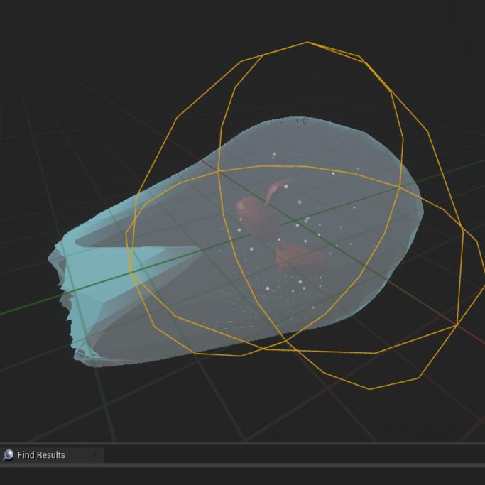
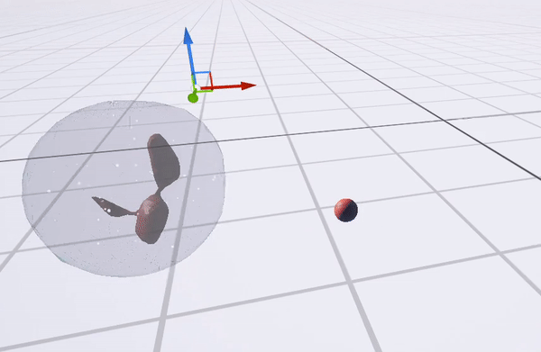
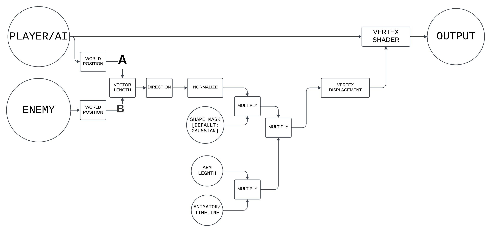

# Procedural Shader Animation

by Shreyash Bara

Exploring Procedurally Generated Animations using Shaders.

DISCLAIMER: It is a simple representation. Thus, it will have some errors as it has been made for my specific need. You are allowed to reference it, or use it if you want.

** BOWs **

# My Implementation

I've made a White Blood Cell using this technique, built in Unreal Engine 4.27, which doesn't require any external tools/modifications to work.

.

.

# Idea

If 'Water' and 'Tree' fake their movement in games using Vertex Displacement, then I can also make my mesh to do this:

.

# Conclusion

Just think of any liquid in microgravity conditions: how it behaves, or deforms.

Fortnite uses it to show 'Hit' on breakable objects. [Ref](https://youtu.be/7Fl3so0Z5Tc).

UPDATE [02/01/2024] : I later played the First "Guardians of the Galaxy" Game and saw this blob enemy, which seems like uses two levels of this technique. [Ref](https://oyster.ignimgs.com/mediawiki/apis.ign.com/guardians-of-the-galaxy-the-game/6/65/Ch3_%287%29.png?width=1280)
